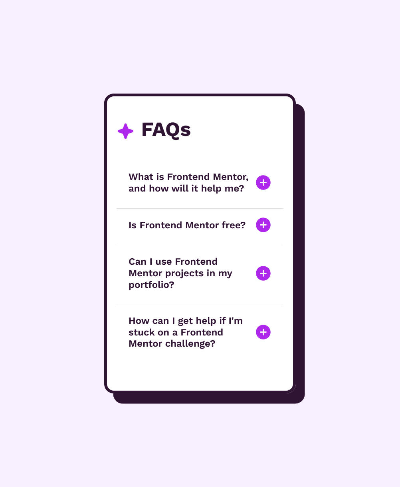

## Table of contents

- [Overview](#overview)
  - [Screenshot](#screenshot)
  - [Links](#links)
- [My process](#my-process)
  - [Built with](#built-with)
  - [What I learned](#what-i-learned)
  - [Continued development](#continued-development)
  - [Useful resources](#useful-resources)
- [Author](#author)
- [Acknowledgments](#acknowledgments)

## Overview

### Screenshot

### Links

- Solution URL: [URL](https://www.frontendmentor.io/solutions/built-using-html-css-bootstrap-xUxsCab-rF)
- Live Site URL: [URL](https://sivin-s.github.io/faq-accordion-main/)

## My process

### Built with

- Semantic HTML5 markup
- CSS custom properties
- Flexbox
- BootStrap
- Mobile-first workflow

### Useful resources

- [w3schools](https://www.w3schools.com/) 
- [MDN](https://developer.mozilla.org/)
- [Youtube](https://youtube.com)
